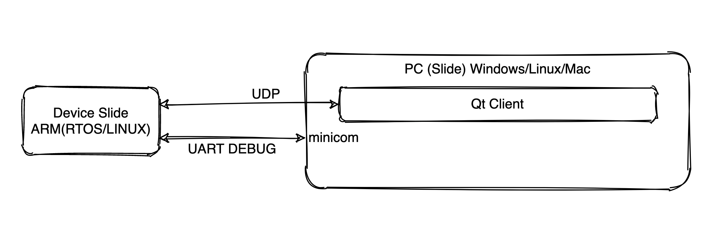

# TUNA 

TUNA工程是一套完整的模拟信号数据采集软件框架。作为软件框架，她可以架设到多种平台设备上来实现模拟信号的数据采集。TUNA可集成到自研科研试验设备的**软核**，实现端到端数据转存、记录与提取功能。

TUNA的基本结构分为三端，agent端，server端和client端。agent端为数据的终端设备，通常是一片集成了操作系统（linux/rtos）的arm核处理器低功耗设备，有离线保存数据、实施采集数据等基础功能；server端是运行在操作系统桌面后台的服务程序，监听agent状态，读取agent的数据，用户无需操心传输协议层面的问题；client端具备多种形式，可以是TUNA包含的界面程序，亦可以是常用科研软件如MATLAB、Python，支持将数据一键导入MATLAB/Python变量的功能。

TUNA除了基础功能以外，还有一定的自研自由度。TUNA将开放一些接口，交由用户实现，可以轻松将TUNA框架集成到自己的项目中。

